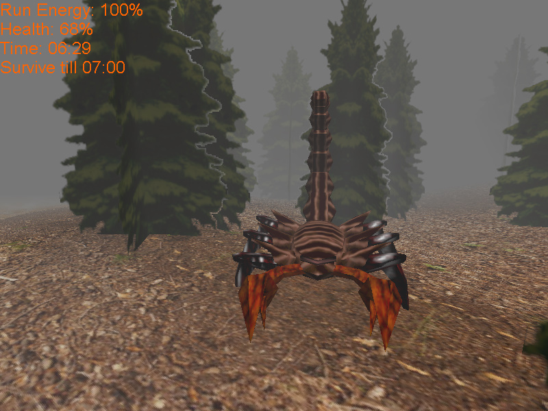

# Nightmare Forest
Nighmare Forest is a game developed in the programming languages DarkBASIC Professional and Delphi. The development stated in 2001 and in 2025 I finally brought the game into Beta stage, after the development had paused several times.

## The Tale of the Nightmare Forest 
*They say there's a grove outside the village.*
*By day it's small, nothing more than a patch of trees.*

*But when night falls, it opens into a forest without end.*
*A few have gone in after dark. None came back.*

*The elders whisper the forest doesn't lose you - it keeps you.*
*And each soul it takes makes the grove a little larger by morning.*

*Today you've set up your tent below the trees,*
*waiting for nightfall... to see if the legend is true.*

## Let's play

see [Let's play of the beta version](https://www.youtube.com/watch?v=5Tp92G5N19c&ab_channel=DanielMarschall)

## How to play

### Download and Installation

- Download Nightmare Forest and DirectX 9.0c here: https://github.com/danielmarschall/forest/releases
- Install DirectX 9.0c (you need this even if you have a newer version of DirectX installed). If Windows requests to install .Net Framework, accept that too.
- After everything is installed, you just need to run ForestLauncher.exe to play the game

### Instructions

- When the clock shows 15:00, enter the tent located between the small patch of trees.
- Survive until the clock shows 7:00
- Leave the forest

### Controls

- WASD keys to move
- Use the mouse to look around
- Hold Ctrl to run (not inside water)
- Hold Shift to slowly walk (regains run energy faster)
- Jump with space key (hold longer for higher jump)

## Known issues

- If you are playing in fullscreen mode, you MUST NOT minimize the game (e.g. using Alt+Tab), otherwise the game will crash once the window is restored. (This is a bug in the DarkBASIC compiler)

## Development

To compile and/or modify the game yourself, you need the following tools:

- DarkBASIC Professional: Free version available at https://github.com/Dark-Basic-Software-Limited/Dark-Basic-Pro/releases/tag/12.02.16

- Embarcadero Delphi: Free version available at https://www.embarcadero.com/de/products/delphi/starter (non-commercial use only)

## License

The main game and source code is licensed under the terms of the Apache 2.0 licenses.

Sound and Graphics files are licensed under various free licenses. See the file **Credits.md** for details.
